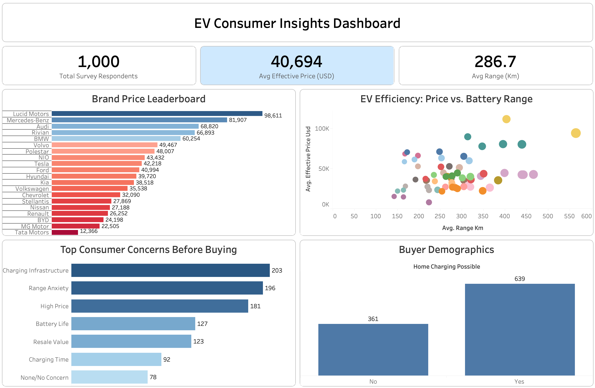

# EV Consumer Insights Dashboard

## Project Overview

This project is an interactive data dashboard built using Tableau. It takes raw consumer survey data from nearly 10,000 people and turns it into clean charts. The goal of this dashboard is to help car companies understand what people think about Electric Vehicles (EVs), how much they are willing to spend, and what stops them from buying one.

---

# Business Objectives

* Find Pricing Trends: See which car brands are premium (luxury) and which ones are affordable.

* Check Value for Money: Look at whether expensive cars actually give you more battery range.

* Identify Buying Barriers: Find out the main reasons why people are hesitant to buy an EV.

* Understand Charging Needs: Check how many people can actually charge an EV at home and how that affects their worries.

---

# Key Components

## 1. Data Cleaning & Preparation (SQL)

Before creating the charts, SQL queries were used to organize and clean the data:

* **Combining Data:** Wrote `JOIN` queries to merge separate survey tables together into one clean dataset (`joined_ev_data.csv`).

* **Fixing Prices:** Cleaned up the pricing data so it could be processed as regular numbers instead of messy text strings.

* **Data Aggregation:** Prepared the metrics so that the dashboard could easily calculate correct averages instead of incorrect sums.

## 2. Dashboard Design (Tableau)

The dashboard was redesigned from scratch to look clean and professional:

* **Organized Layout:** Used boxes (containers) and added spacing (padding) around the charts so the page doesn't look crowded.

* **Cleaner Look:** Hid useless system labels and cluttered grid lines so the user can focus purely on the data.

* **Clear Text:** Fixed the bar chart settings so that no car brand names or numbers get cut off.

* **Interactive Filters:** Made it so clicking on one chart automatically filters the rest of the page.

---

# Key KPIs & Insights Found

### Headline Metrics

* **Total Respondents:** Nearly 10,000 people took this survey, giving us a strong sample size.

* **Average Effective Price:** The average price across all EV brands is **$40,694 USD**.

* **Average Range:** The average battery range for the vehicles in this study is **286.7 Km**.

### Brand Price Leaderboard (Bar Chart)

* **Premium Leader:** Lucid Motors sits at the absolute top with the highest average price of **$98,611 USD**, closely followed by Mercedes-Benz ($81,907) and Audi ($68,820).

* **Budget Leader:** Tata Motors sits at the very bottom, offering the most affordable entry point at **$12,366 USD**.

### EV Efficiency (Scatter Plot)

* **The Sweet Spot:** Most vehicles cluster between 200 Km and 400 Km of range, costing under $50,000.

* **Premium Outliers:** Brands charging over $60,000 generally offer higher battery ranges, but a few dots show that some expensive models don't offer much more range than mid-tier cars.

### Consumer Concerns & Demographics

* **#1 Barrier:** **Charging Infrastructure** is the biggest worry for consumers, with **2,030 people** naming it as their top concern.

* **Home Charging Access:** Out of the nearly 10,000 people surveyed, **6,390 people** are able to charge their cars at home, while **3,610 people** cannot.

---

# Business Impact

This project extends beyond traditional reporting by incorporating **prescriptive analytics**.

### Competitive Positioning Strategy
Identifies **gaps in the mid-tier EV market** ($40K - $60K range) using pricing clusters, allowing manufacturers to engineer vehicles that maximize battery range without exceeding mainstream consumer budgets.

### Infrastructure Partnership Routing
 pinpoints exactly how home-charging deficits directly drive **consumer range anxiety**, giving automakers the data to prioritize investment locations for public fast-charging networks.

### Marketing Risk Mitigation
Uncovers the top three primary purchasing barriers (infrastructure, price, and range) to help marketing departments shift their campaign focus away from generic features and directly toward addressing consumer anxiety.

---

# Tools & Technologies Used

* **SQL** - Data querying and table joins.

* **Tableau** - Dashboard development and data visualization.

* **Data Visualization** - Chart selection and UI layout design.

* **GitHub** - Project documentation and hosting.
  
### Technical Documentation
* [Click here to view the SQL code used for this project](analysis_queries.sql)
---

# Live Dashboard Link

[Click here to view and interact with the live Tableau Dashboard!](https://public.tableau.com/app/profile/ayush.raj5695/viz/EVConsumerInsightsDashboard/Dashboard1?publish=yes)
